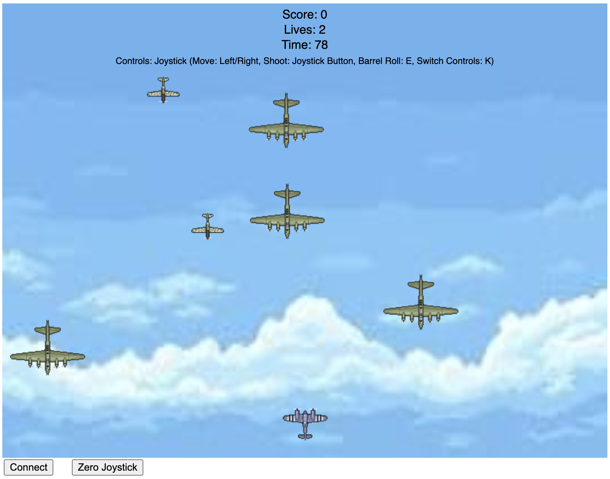

# Skybound Skirmish

## Project Outline
Skybound Skirmish is an engaging browser-based game where players take control of a biplane to battle enemy drones in a thrilling aerial skirmish. The objective is to navigate the sky using a joystick connected via an Arduino or keyboard controls, shooting down two types of enemies—swarm drones and bombers—while avoiding being overwhelmed. Players can seamlessly switch between joystick and keyboard controls at any point during the game by pressing the "K" key, offering flexibility in how they play. With the joystick, move left or right to steer and press the joystick button to shoot; with the keyboard, use the left and right arrow keys to move, the spacebar to shoot, and the "E" key to perform a barrel roll—a defensive maneuver that makes the plane temporarily invincible while displaying a dynamic eight-frame animation of the plane spinning. The game features three scenes: a welcome screen to start, the main gameplay area, and a game-over screen displaying the final score. Players start with three lives and have 90 seconds to achieve the highest score possible by destroying enemies. A buzzer buzzes whenever an enemy is destroyed, providing satisfying feedback, and dynamic audio enhances the experience with background music and explosion sounds.

## Images of the Project
Here are some screenshots showcasing Skybound Skirmish in action:

  
*The welcome screen invites players to start the adventure.*

  
*The biplane shoots down drones while tracking score, lives, and time.*

## Video of It Working
Watch Skybound Skirmish in action! Check out the gameplay video here:  
[Skybound Skirmish Gameplay & Ardunio Board Setup Video]([https://youtu.be/example](https://www.youtube.com/shorts/GV9FF-d2s0g))

## Arduino Board Setup
The game uses an Arduino to interface with a joystick and buzzer, providing physical feedback during play. Below is a photo of the setup along with the pin connections:

  
*The Arduino board with joystick and buzzer connected. Joystick layout: SW -> D4, VRx -> A0, GND -> GND, +5V -> 5V. Buzzer: Pin (on the side with the X on top) -> D9, other pin -> GND.*

## Thoughts About Future Development
Skybound Skirmish has plenty of room to grow! Future enhancements could include:
- Adding new enemy types with unique behaviors, like evasive maneuvers or counterattacks.
- Introducing power-ups, such as temporary shields or faster firing rates, to add strategic depth.
- Enhancing the audio with more dynamic sound effects, like engine noises that change with speed.
- Implementing a high-score leaderboard to encourage replayability.
- Exploring a two-player mode, either cooperative or competitive, to make the skies even more exciting.
